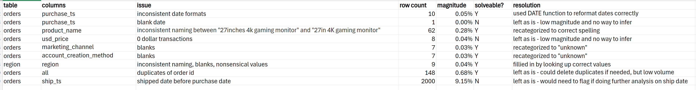
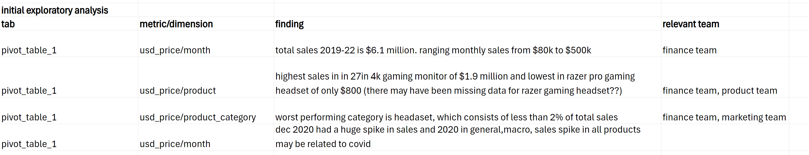
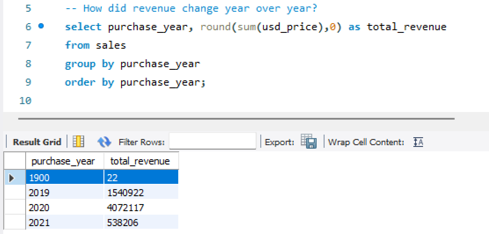
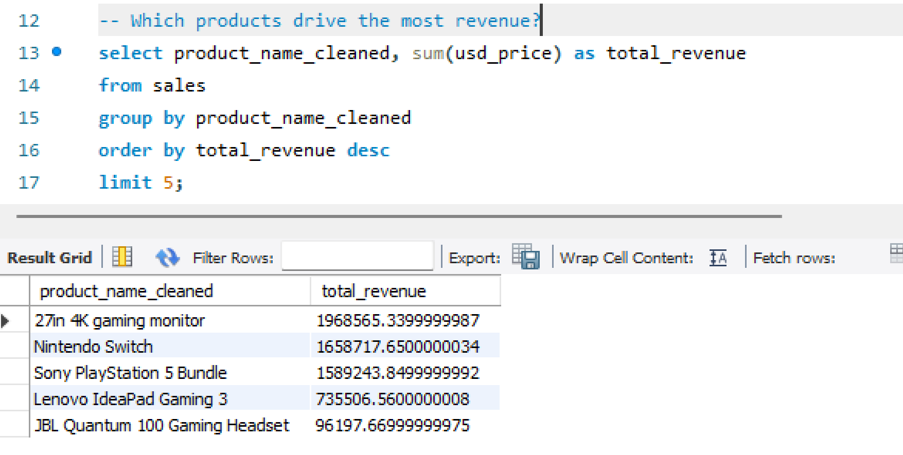
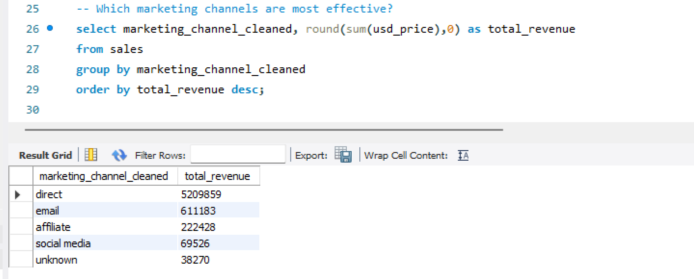
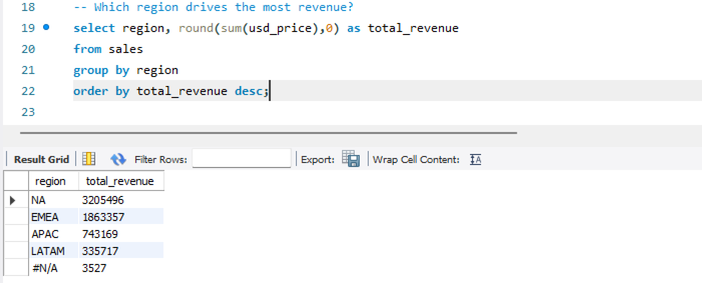
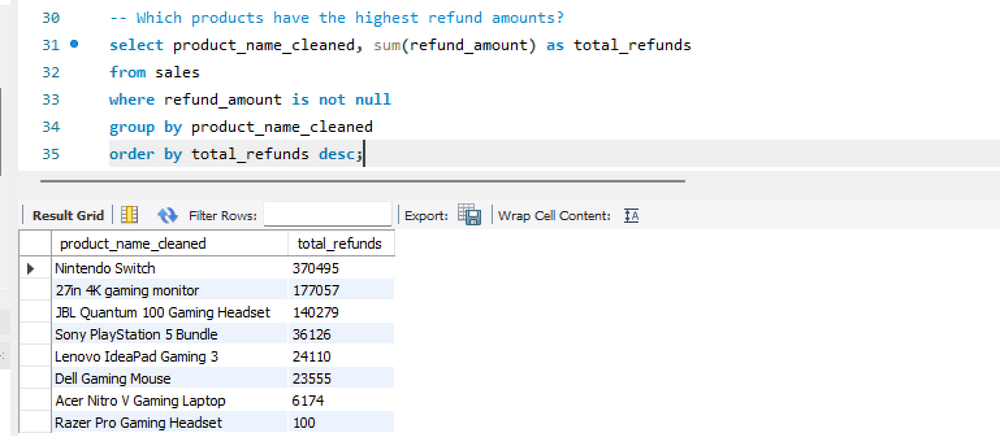
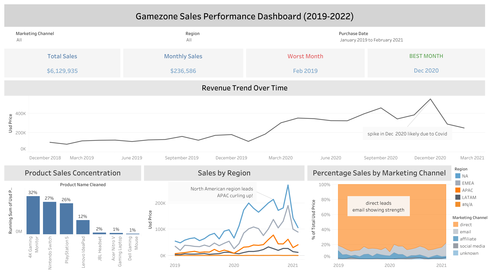

# Puspa Bhatt | Analysis Portfolio

Gamezone is a gaming equipment company. I analyzed its 2019–2021 sales data to uncover trends and draw insights.

**Goal:** Understand revenue trends over time, identify top-performing products and regions, and generate actionable insights to optimize sales and marketing.

---

## Featured Project: Gamezone Sales Performance Analysis

**Business Question:**  
How did revenue perform from 2019–2021, and which products and periods drove performance?

**What I Did:**  
- Cleaned and analyzed 20,000+ sales transactions  
- Built an interactive Tableau dashboard 
- Identified high-performing products and periods, as well as underperforming categories
- Provided actionable recommendation

**Tools Used:**  
Excel | SQL | Tableau

---

## Data Cleaning and Preparation

Cleaned and standardized the dataset in Excel using filters and pivot tables, identified duplicates, and maintained an issue log.

Issue Log

  

---

## My Thought Process

Before diving into the data, I set up a framework to guide my analysis:

- Stakeholder Goal: Focused on high-level trends since this is fictional data.  
- Columns and Coverage: Used usd_price, product_name, and purchase_ts.  
- Aggregates and Anomalies: Examined total revenue across months and products, as well as averages, max, and min.  
- Notable Segments: Sliced data by region and marketing channels.  

---

## Initial Exploratory Analysis

After cleaning the data and creating the framework, I used pivot tables in Excel for initial exploration and trend discovery.

Pivot Table

  

---

## SQL Analysis

Imported the cleaned data into SQL to answer key business questions.

Revenue Change Year Over Year

**Insight:** Overall growth patterns.

Top 5 Products by Revenue

**Insight:** A small number of products generate most of the revenue.

Revenue by Marketing Channel

**Insight:** Direct traffic drives the most revenue.

Revenue by Region

**Insight:** Revenue is concentrated in North America.

Refund Impact by Product

  

**Insight:** Refunds are concentrated in a few products.

---

## Tableau

After answering key business questions with SQL, I imported the data into Tableau to create interactive visualizations.

Explore trends yourself: [View Tableau Dashboard](https://public.tableau.com/views/gamezone_17701357541600/Dashboard1?:language=en-US&:display_count=n&:origin=viz_share_link)

**Key Insights:**  
- Total revenue reached **$6.1M** with monthly average of **$236k**
- December 2020 showed an unusual spike, likely influenced by COVID demand  
- Revenue is concentrated among a few top products (gaming monitor, nintendo switch, playstation)
- Categories like headsets contributed minimally  
- Direct traffic drives strong sales, but email marketing shows growth potential  
- Revenue is concentrated in North America and EMEA regions  

---

## Key Insights & Strategic Recommendations

Based on the analysis, I recommend the following actions:

**Marketing:**  
- Prioritize email campaigns to capture growth potential and reduce reliance on direct traffic  
- Increase targeted promotions in the EMEA region to drive revenue  

**Product:**  
- Remove underperforming items, such as headsets, contributing less than 2% of total revenue  

**General / Business Insight:**  
- Recognize that increased time at home correlates with higher spending on gaming products, informing future marketing and product strategies  

> These recommendations will help optimize sales, increase revenue, and reduce the reliance on one marketing channel.
---

## About Me

Hi, I’m Puspa! I recently graduated from NC State University with a degree in Business Administration, concentrating in IT, and I’m excited to start my career in analytics.

I work with Tableau, SQL, and Excel to explore data and uncover meaningful insights. I believe every dataset tells a story, the key is asking the right questions. 

---

## Contact

- Email: bhattpuspa2002@gmail.com  
- LinkedIn: www.linkedin.com/in/puspabhatt  
